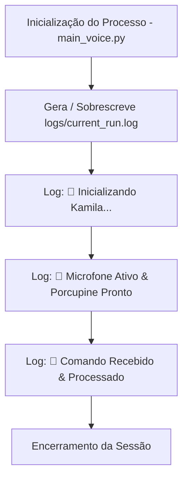

# Documentação Técnica: Log de Sessão Ativa (`logs/current_run.log`)

Esta documentação descreve o propósito, o comportamento e as especificações do arquivo **`current_run.log`**, localizado no diretório `logs/current_run.log`. Este arquivo armazena a **telemetria da execução em tempo real da sessão ativa** da assistente **Kamila**.

---

## 1. Visão Geral e Propósito

Diferente do log histórico acumulado (`logs/kamila.log`), o `current_run.log` é dedicado exclusivamente ao rastreamento da instância atual em execução. Ele é atualizado dinamicamente pelos scripts de entrada (`main_voice.py`, `main_cli.py`, `vigia.py`).



---

## 2. Padrão de Registro e Formatação

Os eventos são salvos em codificação texto com o seguinte padrão:

```text
YYYY-MM-DD HH:MM:SS,mmm - nome_do_modulo - SEVERIDADE - Mensagem do Evento
```

### Exemplo de Entradas Típicas:
```text
2026-07-23 20:14:00,102 - __main__ - INFO - 🚀 Inicializando Kamila Voice Interface...
2026-07-23 20:14:01,456 - core.stt_engine - INFO - Microfone padrão ativado com sucesso.
2026-07-23 20:14:05,789 - core.interpreter - INFO - Intenção identificada: time (Confiança: 1.0)
2026-07-23 20:14:06,012 - core.tts_engine - INFO - Resposta sintetizada com sucesso.
```

---

## 3. Casos de Uso para Diagnóstico

1. **Auditoria Rápida de Sessão**: Permite ao desenvolvedor inspecionar apenas os eventos da última execução sem precisar filtrar milhares de linhas de execuções passadas.
2. **Detecção de Deadlocks em Background**: Verifica se o loop de eventos parou ou se a thread de escuta congelou durante o ciclo atual.

---

## 4. Política de Privacidade e Git

> [!CAUTION]
> **Privacidade do Usuário**: O arquivo `current_run.log` registra frases ditas e transcrições ao vivo. Ele é mantido estritamente local e está **ignorado no Git** via `.gitignore` (`*.log`).
